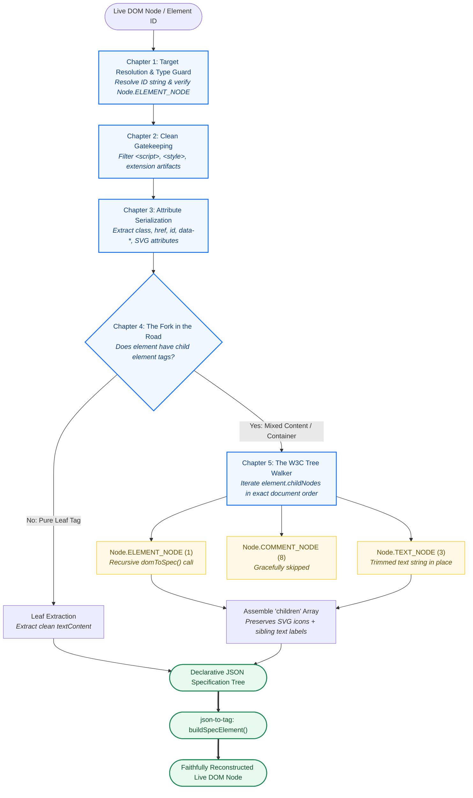

# @keshavsoft/tag-to-json

Zero-dependency native DOM element to declarative JSON specification extractor. 

`tag-to-json` is the direct reverse companion to [`@keshavsoft/json-to-tag`](https://www.npmjs.com/package/@keshavsoft/json-to-tag). While `json-to-tag` builds real DOM elements from JSON specifications, `tag-to-json` captures live rendered DOM nodes and converts them back into clean, canonical JSON specification trees.

[](https://www.npmjs.com/package/@keshavsoft/tag-to-json)
[](LICENSE)
[](https://keshavsoft.github.io/tag-to-json/)

> 🎮 **[Interactive Showcase & Live Demo](https://keshavsoft.github.io/tag-to-json/)**: Test live element extraction, round-trip re-rendering with `json-to-tag`, and one-click JSON downloading directly in your browser.

---

## Features

- ⚡ **Zero Dependencies & Ultra Fast:** Lightweight pure JavaScript (~1 kB), no DOM libraries required.
- 🔁 **Full Round-Trip Fidelity:** Output specs can be passed directly into `json-to-tag`'s `buildSpecElement({ inSpec })`.
- 🏷️ **Clean Spec Generation:** Automatically captures `tagName`, all element `attributes` (classes, data attributes, inline styles), child hierarchies (`children`), and leaf `textContent`.
- 🛡️ **Strict Parameter Convention:** Built strictly following the `in`-prefixed parameter and `local`-prefixed variable convention.
- 🌐 **Browser Ready:** Auto-registers `window.tagToJson` and `window.ks['tag-to-json']` for effortless browser console testing and integration.

---

## Installation

```bash
npm install @keshavsoft/tag-to-json
```

---

## Usage

### 1. In Modern JavaScript (ES Modules)

```javascript
import { tagToJson } from "@keshavsoft/tag-to-json";

// Pass an element directly or an element ID string:
const spec = tagToJson({
  inElement: document.getElementById("myTable")
});

console.log(JSON.stringify(spec, null, 2));
```

### 2. Browser DevTools Console / Direct Script

When included via `<script type="module" src="...">`, it automatically mounts to `window`:

```javascript
// Inspect any element on a live page and extract its spec:
const spec = window.tagToJson({ inElement: $0 });

// Or pass an ID directly:
const tableSpec = window.tagToJson("stockItemsTable");
```

---

## Example: Round-Trip Workflow

```javascript
import { tagToJson } from "@keshavsoft/tag-to-json";
import { buildSpecElement } from "@keshavsoft/json-to-tag";

// 1. Capture existing HTML element as a JSON spec
const tableElement = document.querySelector("#my-table");
const spec = tagToJson({ inElement: tableElement });

// 2. Re-create the DOM node anywhere using json-to-tag
const recreatedElement = buildSpecElement({ inSpec: spec });
document.getElementById("container").appendChild(recreatedElement);
```

---

## API Reference

### `tagToJson({ inElement, inConfig })`

| Parameter | Type | Default | Description |
| :--- | :--- | :--- | :--- |
| `inElement` | `HTMLElement \| string` | *required* | The DOM element node or string ID of the target element. |
| `inConfig` | `Object` | `{}` | Optional extraction configuration. |
| `inConfig.includeScripts` | `boolean` | `false` | Whether to include `<script>` tags in output spec. |
| `inConfig.includeStyles` | `boolean` | `false` | Whether to include `<style>` tags in output spec. |

**Returns**: `Object|null` — The declarative JSON specification object ready for `json-to-tag`.

---

## Architecture & W3C DOM Standards

`tag-to-json` v5 implements the **W3C/WHATWG DOM Level 4 Standard** for node traversal:
- **[WHATWG DOM Specification — Node.nodeType](https://dom.spec.whatwg.org/#dom-node-nodetype)**
- **[MDN Web Docs — Node.nodeType](https://developer.mozilla.org/en-US/docs/Web/API/Node/nodeType)**
- **[MDN Web Docs — Node.childNodes](https://developer.mozilla.org/en-US/docs/Web/API/Node/childNodes)**

### The 5-Chapter Serialization Pipeline Flowchart



### The 5 Chapters Explained

1. **Chapter 1: Target Resolution & Type Guard**
   - Resolves string element IDs (`document.getElementById`) or validates that an input object is a valid DOM node (`nodeType === Node.ELEMENT_NODE`).
2. **Chapter 2: Clean Gatekeeping & Noise Filtering**
   - Strips non-visual tags (`<script>`, `<style>`, `<noscript>`) and browser extension injected attributes/nodes (e.g. `GOOGLE_INPUT_CHEXT_FLAG`).
3. **Chapter 3: Attribute Dictionary Serialization**
   - Serializes standard HTML/SVG attributes into clean key-value pairs, maintaining compatibility with SVG attributes (`xlink:href`, `viewBox`).
4. **Chapter 4: The Fork in the Road**
   - Distinguishes pure leaf tags (`<h1>Dashboard</h1>`) from containers and mixed-content elements.
5. **Chapter 5: The W3C Tree Walker (`childNodes`)**
   - Traverses `element.childNodes` using official W3C `nodeType` constants so that sibling text nodes are never lost when an element also contains child tags (e.g. icons).

| W3C Constant | Value | Role in `tag-to-json` |
| :--- | :---: | :--- |
| **`Node.ELEMENT_NODE`** | **`1`** | Recursively converted to a child JSON specification object. |
| **`Node.TEXT_NODE`** | **`3`** | Preserved as a trimmed string inside the `children` array in exact document position. |
| **`Node.COMMENT_NODE`** | **`8`** | Gracefully skipped to keep specs lightweight and clean. |

### Real-World Mixed Content: Bootstrap 5 Navigation Links
When an element contains both vector icons and text labels, such as:
```html
<a class="nav-link d-flex align-items-center gap-2" href="#">
  <svg class="bi"><use xlink:href="#cart"></use></svg>
  Orders
</a>
```
The v5 W3C Tree Walker captures both in exact order:
```json
{
  "tagName": "a",
  "attributes": {
    "class": "nav-link d-flex align-items-center gap-2",
    "href": "#"
  },
  "children": [
    {
      "tagName": "svg",
      "attributes": { "class": "bi" },
      "children": [
        { "tagName": "use", "attributes": { "xlink:href": "#cart" } }
      ]
    },
    "Orders"
  ]
}
```
This specification round-trips 100% losslessly into `@keshavsoft/json-to-tag`.

---

## License

[MIT](LICENSE) © [KeshavSoft](https://github.com/keshavsoft)
