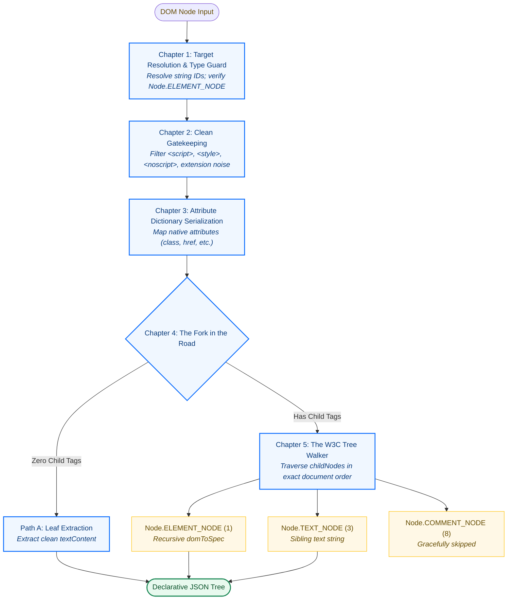

# domToSpec Engine (v5)

## The Story of Native DOM to JSON Serialization

The `domToSpec` engine transforms any native browser DOM tree into a declarative, lightweight JSON specification tree compatible with `json-to-tag`.

Instead of treating DOM serialization as a flat recursion, the v5 engine models the process as a cohesive narrative across 5 distinct chapters:



```
DOM Node Input
      │
      ▼
┌──────────────────────────────────────────────┐
│ Chapter 1: Target Resolution & Type Guard    │ ➔ Resolve string IDs; verify Node.ELEMENT_NODE
└──────────────────────┬───────────────────────┘
                       │
                       ▼
┌──────────────────────────────────────────────┐
│ Chapter 2: Clean Gatekeeping                 │ ➔ Filter <script>, <style>, <noscript>, extension noise
└──────────────────────┬───────────────────────┘
                       │
                       ▼
┌──────────────────────────────────────────────┐
│ Chapter 3: Attribute Dictionary Serialization│ ➔ Map native attributes (class, href, etc.)
└──────────────────────┬───────────────────────┘
                       │
                       ▼
┌──────────────────────────────────────────────┐
│ Chapter 4: The Fork in the Road              │
└──────────────┬────────────────┬──────────────┘
               │                │
       Zero Child Tags    Has Child Tags
               │                │
               ▼                ▼
     ┌──────────────────┐  ┌────────────────────────────────────────────────────────┐
     │ Path A: Leaf     │  │ Chapter 5: The W3C Tree Walker                         │
     │ Extract clean    │  │ Traverse childNodes in exact document order:            │
     │ `textContent`    │  │ • Node.ELEMENT_NODE (1) ➔ Recursive domToSpec           │
     └──────────────────┘  │ • Node.TEXT_NODE    (3) ➔ Sibling text string           │
                           │ • Node.COMMENT_NODE (8) ➔ Gracefully skipped            │
                           └────────────────────────────────────────────────────────┘
```

---

## W3C Standard Grounding

- **W3C/WHATWG DOM Level 4 Standard**: [https://dom.spec.whatwg.org/#dom-node-nodetype](https://dom.spec.whatwg.org/#dom-node-nodetype)
- **MDN Web Docs**: [https://developer.mozilla.org/en-US/docs/Web/API/Node/nodeType](https://developer.mozilla.org/en-US/docs/Web/API/Node/nodeType)

### Node Types Utilized:
- `Node.ELEMENT_NODE === 1`: Identifies HTML and SVG element tags.
- `Node.TEXT_NODE === 3`: Identifies textual strings that live alongside element tags.

---

## Why `childNodes` is Required for Mixed Content

Modern UI frameworks like Bootstrap 5 frequently place SVG icons and text directly inside clickable links:
```html
<a class="nav-link d-flex align-items-center gap-2" href="#">
    <svg class="bi" aria-hidden="true"><use xlink:href="#cart"></use></svg>
    Products
</a>
```
Using `element.children` drops the text node `"Products"`.
Using `element.childNodes` with `nodeType` checks produces the exact mixed array:
```json
{
  "tagName": "a",
  "attributes": {
    "class": "nav-link d-flex align-items-center gap-2",
    "href": "#"
  },
  "children": [
    {
      "tagName": "svg",
      "attributes": {
        "class": "bi",
        "aria-hidden": "true"
      },
      "children": [
        {
          "tagName": "use",
          "attributes": {
            "xlink:href": "#cart"
          }
        }
      ]
    },
    "Products"
  ]
}
```
This specification round-trips 100% faithfully into `json-to-tag`.
